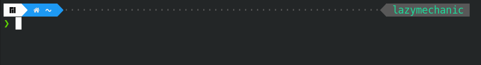

 ## How to install 
 **via curl**
 ```bash
bash -c "$(curl -fsSL https://raw.githubusercontent.com/LazyMechanic/configs/master/install-dotfiles.sh) "$ZSH_CUSTOM""
 ```

**via wget**
```bash
bash -c "$(wget -O- https://raw.githubusercontent.com/LazyMechanic/configs/master/install-dotfiles.sh) "$ZSH_CUSTOM"" 
```

## Themes
### LazyMechanic

### Powerlevel10k (lean)

### Powerlevel10k (classic)

### Powerlevel10k (rainbow)

### Default

