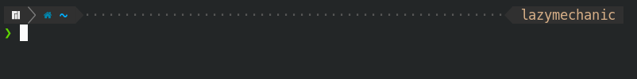

## Dependencies

### Zsh prompt
| Name                                            | Required | Description                                     | 
|-------------------------------------------------|:--------:|-------------------------------------------------| 
| zsh                                             | ✓        | Shell prompt which we configuring               | 
| [Oh-my-zsh](https://github.com/ohmyzsh/ohmyzsh) | ✓        | Zsh framework for pretty view                   | 
| Font MesloLGS NF                                | ✖        | Powerline font for pretty view. Include in repo | 

### i3wm
| Name           | Required | Description                       | 
|----------------|:--------:|-----------------------------------| 
| i3-gaps        | ✓        | Fork of i3                        | 
| Font Noto Sans | ✖        | Nice font which I use             | 
| feh            | ✓        | Show wallpaper                    | 
| dunst          | ✓        | Notification daemon               | 
| compton        | ✓        | Compositor for X                  | 
| polybar        | ✓        | More changeable bar instead i3bar | 
| i3lock         | ✖        | Lock screen                       | 

### General
| Name      | Required | Description                                                             | 
|-----------|:--------:|-------------------------------------------------------------------------| 
| systemd   | ✓        | Provides a system and service manager                                   | 
| acpid     | ✓        | Daemon for delivering ACPI events                                       | 
| git       | ✓        | Just git                                                                | 
| python 3+ | ✓        | Just python v3.0+                                                       | 
| autorandr | ✓        | Automatically select a display configuration based on connected devices | 
| arandr    | ✖        | Provides a simple visual front end for XRandR                           | 


## How to install 
 **via curl**
 ```bash
bash -c "$(curl -fsSL https://raw.githubusercontent.com/LazyMechanic/dotfiles/master/install/install-dotfiles.sh) ${ZSH_CUSTOM:-~/.oh-my-zsh/custom}"
 ```

**via wget** 
```bash
bash -c "$(wget -O- https://raw.githubusercontent.com/LazyMechanic/dotfiles/master/install/install-dotfiles.sh) ${ZSH_CUSTOM:-~/.oh-my-zsh/custom}" 
```

## Zsh themes
### LazyMechanic

### Powerlevel10k (lean)

### Powerlevel10k (classic)

### Powerlevel10k (rainbow)

### Default

